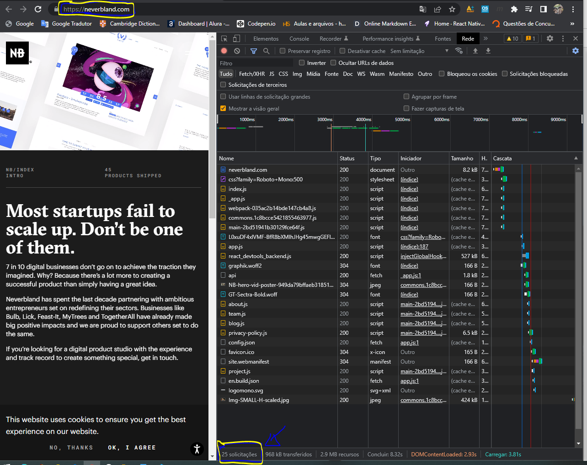

# Praticas Sugeridas da Aula 01
## Respostas
1) Foram visitado o site [https://neverbland.com](https://neverbland.com) usando o navegador Chrome e tirado o print da tela conforme representado abaixo.  

Durante a análise, foi verificado que foram realizadas 25 solicitações ao servidor web e que todas as solicitações foram respondidas com status **200** (*ok*) e **304** (*not modified*), ou seja, quando os recursos já estão em cache.
